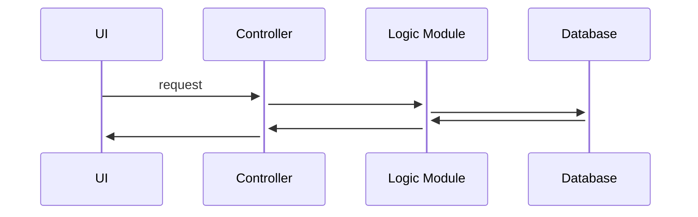
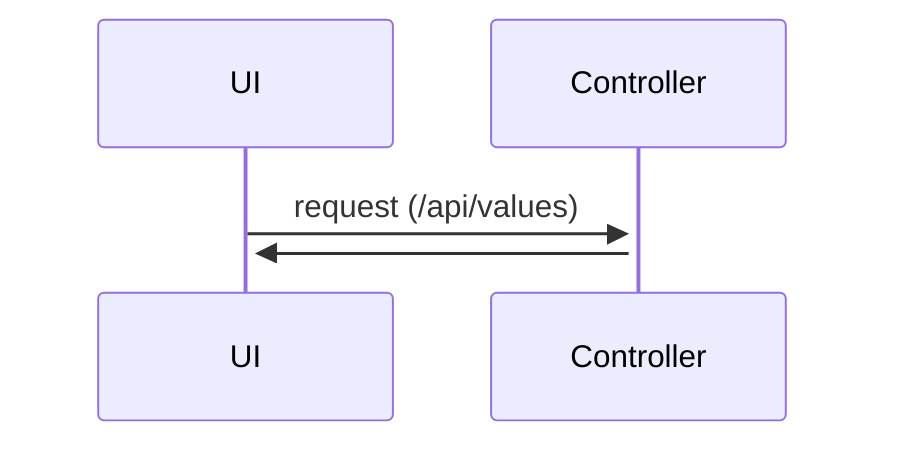

# Aufgabe 2

In Aufgabe zwei geht es schon um das Programmieren und Installieren von Visual Studio.
Allerdings gilt es hier auch darauf zu achten das man auch **Visual Studio** und nicht Visual Studio Code
sich Installiert, weil beides etwas anderes ist. Visual Studio ist eine IDE. Eine IDE beinhält sehr viele 
Features, Funktionen und Vorlagen, die von dem Entwickler in dem fall Microsoft direkt beim Download auch mitenthalten 
ist und ist meistens für eine bestimmte Sprache oder Sprach-Gruppe ausgelegt. Visual Studio Code hingegen ist ein Code Editor. 
Code Editoren kann man für alles mögliche Verwenden allerdings gibt es da auch sehr wenige Funktionen und Vorlagen da das 
meiste von der Community dann erstellt wird und man die Funktionen extra sich noch heraussuchen muss und Installieren muss.

## Installation von Visual Studio

Um Visual Studio zu installieren und einzurichten habe ich mir Visual Studio von der Webseite [](https://visualstudio.microsoft.com/de/free-developer-offers/)heruntergeladen.
Hierbei habe ich beachtet, dass ich das Rosane herunterlade da das auch die IDE ist die ich Brauche.

Sobald ich die `Visual Studio.exe` Datei ausgeführt habe, hat sich ein Fenster geöffnet, wo ich Auswählen muss was ich benötige.
Hier habe ich dann `ASP.NET und Webentwicklung`, `.NET-Desktopentwicklung` ausgewählt und installiert.

Nach ein paar Minuten war die Installation auch schon fertig und dann sollte das endresultat wie folgt aussehen:


Sollte man änderungen vornehmen wollen an der Installation oder Funktionen hinzufügen kann man diese dann hinzufügen, indem 
man im Installer dann auf `Ändern` klickt und die jeweiligen Kästchen auswählt.

Sollte man nun auf `Starten` klicken lädt die Applikation kurz und dann sollte man folgendes Fenster sehen:


Da es fürs Erste nicht nötig ist, werde ich mich in dem fall nicht Anmelden und somit erstmal auf `erst mal überspringen` klicken.

Nach dem man die IDE für sich Personalisiert hat findet man sich in der Projektübersicht wieder.


## Erstellen eines neuen Projektes

In der Projektübersicht angekommen müssen wir ein neues ASP.NET Core Web-App erstellen.
Dafür klickt man als Erstes auf `Neues Projekt erstellen`. Hier wählt man dann bei `Alle Sprachen`, `C#` aus, bei `Alle Plattformen`, `Windows` und bei `Alle Projekttypen` dann `API`.

Dann sollte ganz oben `ASP.NET Core-Web-API` auftauchen. Nun klickt man nur noch auf `Weiter` und dann unter `Projektname` dann den Namen deines Projektes. 
Wenn man jetzt wieder auf `Weiter` klickt, sollte man dann zu weiteren Einstellungen kommen. hier habe ich die Standarteinstellungen so gelassen.


Nachdem man auf `Erstellen` geklickt hat sollte das Projekt für dich Generiert werden und dann sollte es wie folgt aussehen:


## Der erste Start

Sobald das Projekt erstellt wurde mit der ASP.NET Core Web-API Vorlage sollte man nun in der Lage sein das Projekt zu 
starten um Sicher gehen zu können, ob das projekt erfolgreich und ohne Fehler wirklich erstellt wurde.

Um das Projekt zu starten, muss man dann nur oben auf den Grünen Pfeil klicken, wo `https` steht. Dann sollte der Google 
Chrome Browser sich öffnen mit der generierten Standard Seite. Solltest du einen anderen Browser Bevorzugen kannst du 
diesen auch ändern, indem du auf den weißen pfeil rechts neben dem `https` Text klickst und dann bei `Webbrowser` deinen 
Browser nach wah aussuchst. Beachte allerdings das Google Chrome am besten funktionieren sollte.

Sobald der Webserver gestartet ist, sollte sich dann ein Google Chrome Fenster Öffnen und folgendes Anzeigen


## Erstellung eines neuen Controllers

Bevor wir ein Controller erstellen müssen, wir erstmal wissen, wofür ein Controller ist und was der macht.



Alle Interaktionen und Anfragen gehen von der UI als Erstes zum `Controller` und vom `Controller` dann zum `Logic Module` und dann zur `Datenbank`


Nun können wir einen Controller erstellen, indem wir bei dem `Controllers` Ordner Rechtsklick machen und dann auf `Hinzufügen` und dann auf `Controller`.
Jetzt sollte sich ein Fenster öffnen mit sachen die man Auswählen kann. Dieses Fenster sieht dann wie folgt aus:


Sobald das Fenster dann offen ist wählen wir Links dann `API` aus und dann `API Controller - Leer`. Als Nächstes kannst 
du dann einen Namen für den Controller vergeben allerdings ist es hier besser den Standard Namen bei-belassen. In meinem
Fall ist es `ValuesController.cs`. Danach kann man dann auf Hinzufügen klicken.

Jetzt sollte sich ein neues Fenster geöffnet haben dies sieht wie folgt aus:


In dem Tutorial wird erklärt das man etwas von ihn hinein Kopieren sollte. Allerdings gibt es dazu keine Referenz oder code zum kopieren somit Tippe ich das von selbst ab.

```c#
using Microsoft.AspNetCore.Http;
using Microsoft.AspNetCore.Mvc;

namespace Web_API.Controllers
{
    [Route("api/[controller]")]
    [ApiController]
    public class ValuesController : ControllerBase
    {
        [HttpGet]
        public IEnumerable<string> Get() 
        {
            return new string[] {"Values 1", "Values 2", "Values 3", "values4"};
        }
        
        [HttpGet("{id}")]
        public string Get(int id) 
        {
            return "The value is "+id;
        }
    }
}
```
nun kann man das Program noch einmal starten und dann im Link `weatherforecast` hinzufügen so das der Link so ähnlich wie `https://localhost:7146/weatherforecast` ist.
Wenn es geklappt hat, dann sieht die Seite wie folgt aus:


und wenn man `/api/values` aufruft dann sollte die Seite wie folgt aussehen:


Sobald man diese Seite aufruft und das auch Wiederbekommt dann hat es geklappt.


## Was macht der Code und wie funktioniert der?

zum aktuellen Zeitpunkt verläuft das so:



Der Nutzer sendet eine Anfrage an die UI. Die UI übergibt die Anfrage an dem Controller und der Controller sendet dann 
die jeweiligen Daten wieder zurück. In dem Fall sind es die folgenden Daten:

```json
["Values 1","Values 2","Values 3","values4"]
```

Nun schauen wir uns den Code etwas genauer an.

| Methode                                                              | Beschreibung                                                                                                                                                                                                                                                 |
|----------------------------------------------------------------------|--------------------------------------------------------------------------------------------------------------------------------------------------------------------------------------------------------------------------------------------------------------|
| [Route("api/[controller]")]                                          | Ist dafür da um dem Controller bzw der Web API zu sagen das der Link für diesen Controller `/api/values` ist und das man den darüber aufrufen kann. Wenn man nicht will das man /api/values Schreiben muss dann kann man `api/` auch einfach weg lassen.     |
| [HttpGet]                                                            | Sagt dem Program dass das eine `GET` Anfrage ist.                                                                                                                                                                                                            |
| return new string[] {"Values 1", "Values 2", "Values 3", "values4"}; | Sagt das `["Values 1","Values 2","Values 3","values4"]` Zurückgegeben werden soll.                                                                                                                                                                           |
| [HttpGet("\{id}")]                                                   | Funktioniert wie `[HttpGet]` allerdings wird hier mit `[HttpGet("{id}")]` gesagt das es sich hier um etwas handelt was man nach dem `values` Schreibt. Also z.B. `/api/values/1`                                                                             |
| public string Get(int id)                                            | Ist auch eine Klasse für den `values` Endpunkt allerdings tritt das erst dann in Kraft wenn da auch eine zahl Definiert ist. Also z.B. `/api/values/1`                                                                                                       |

auf die andere Klasse kommen wir noch in den nächsten Schritten.

Jetzt fragt man sich sicher woher, das Program weiß, dass es bei diesem Controller um den `ValuesController.cs` handelt. 
Ganz Einfach. So wie ich es verstanden habe nimmt sich das dein Controller aus dem Namen. Das heißt wenn deine Controller Datei `AirController.cs` heißt dann handelt es sich bei `[controller]` dann um das Wort `air`

## Ändern des Startpfades

Wir haben sicher schon gemerkt das, wenn jedes Mal, wenn wir den Webserver Starten das wir auf eine bestimmte Seite immer 
weitergeleitet werden. Diesen Standartpfad werden wir hier jetzt mal abändern zu unserer Values API Endpunkt.

Als Erstes suchen wir nach dem Ordner `Properties`. In diesem Ordner sollte dann eine Datei namens `launchSettings.json` zu finden Sein.
Diese sieht dann wie folgt aus:


In dieser Datei müssen wir bei `profiles` folgendes ändern:

````json
"profiles": {
  "http": {
    "commandName": "Project",
    "dotnetRunMessages": true,
    "launchBrowser": true,
    "launchUrl": "api/values",
    "applicationUrl": "http://localhost:5188",
    "environmentVariables": {
      "ASPNETCORE_ENVIRONMENT": "Development"
    }
  },
````

also bei `launchUrl` von `swagger` zu `api/values` ändern.

> **Warnung**
> 
> Sollte das bei dir nicht funktioniert haben stelle einfach überall wo `swagger` steht zu `api/values` um.
> 
{style="warning"}

## Erstellen von Models

### Wofür sind Models?

### Wie erstellt man ein Model?

Um ein Model zu erstellen ist es wichtig ein ungeschriebenes Gesetz zu befolgen. Und zwar bekommen Models auch immer ihren eigenen `Models` Ordner.
Als Nächstes erstellen wir eine Klasse in diesem `Models` ordner. In diesem Fall haben wir diese Klasse Book wie im Tutorial genannt und fügen folgende Zeilen hinzu:

````c#
using System;
using System.Collections.Generic;
using System.Linq;
using System.Threading.Tasks;
namespace Web_API.Models
{
    public class Book
    {
        public int Id { get; set; }
        public string Author { get; set; }
        public string Title { get; set; }
        public int PublicationYear { get; set; }
        public bool IsAvailable { get; set; }
        public string CallNumber { get; set; }
    }
}
````

### Erstellung des Books Controllers

Um den Controller `Books` zu erstellen, muss man hier wieder bei dem `Controllers` Ordner rechtsklick machen und dann auf Hinzufügen > Controller. Dann öffnet sich wieder ein Fenster. In diesem Fenster wählen wir dann links wieder API aus und nehmen `API Controller - Empty`, klicken auf Hinzufügen und nun müssen wir es unten bei Name `BooksController` nennen.

Nun sollte sich eine wieder eine neue Datei Öffnen und drinnen steht folgendes:

```c#
[...]

namespace Web_API.Controllers
{
    [Route("api/[controller]")]
    [ApiController]
    public class BooksController : ControllerBase
    {
    
    }
}
```

> **Info**
>
> `[...]` bedeutet nichts weiter als einfach die Standarddaten wie `using Microsoft.AspNetCore.Http;` usw. Es ist einfach nur ein Platzhalter und bedeutet das hier Daten sind.
{style="note"}

Sobald wir sichergestellt haben das die Datei erfolgreich erstellt wurde fügen wir nun die folgenden Testdaten ein.

> **Info**
> 
> In dem Tutorial Video wird ständig gesagt, das man es von der verlinkten Ressource sich rauskopieren soll, allerdings ist weder in der Beschreibung, noch in den Kommentaren ein Link wo man das Raus kopieren kann. Somit habe ich das abgetippt.
{style="note"}

```c#
[...]
public class BooksController : ControllerBase
{
    public List<Book> books = new List<Book>() {
        new Book {Id = 1, Title = "The Girl on the Train", Author = "Hawkins, Paula",PublicationYear = 2015,isAvailable = false, CallNumber = "F HAWKI}
        new Book {Id = 2, Title = "Rogue Lawyer", Author = "Grisham, John", PublicationYear = 2015, CallNumber = "F GRISH", IsAvailable = false}
        new Book {Id = 3, Title = "After You", Author = "Moyes, Jojo", PublicationYear = 2015, CallNumber = "F MOYES", IsAvailable = false}
        new Book {Id = 4, Title = "All the Light We Cannot See", Author = "Doerr, Anthony", PublicationYear = 2014, IsAvailable = false, CallNumber = "F DOERR"}
        new Book {Id = 5, Title = "The Girls", Author = "Cline, Emma", PublicationYear = 2016, CallNumber = "F CLINE", IsAvailable = false}
        new Book {Id = 6, Title = "The Martian", Author = "Weir, Andy", PublicationYear = 2011, CallNumber = "SF WEIR", IsAvailable = false}
        new Book {Id = 7, Title = "Me Before You", Author = "Moyes, Jojo", PublicationYear = 2012, CallNumber = "F MOYES", IsAvailable = false}
        new Book {Id = 8, Title = "Alexander Hamilton", Author = "Chernow, Ron", PublicationYear = 2004, CallNumber = "B HAMILTO A", IsAvailable = false}
        new Book {Id = 9, Title = "Before the Fall", Author = "Hawley, Noah"m PublicationYear = 2016, CallNumber = "F HAWLE", IsAvailable = false}
        
    };
}
[...]
```

> **Info**
> 
> Solltest du einen Fehler bekommen bei `Book` das es nicht existiert dann Hovere mit der Maus über den `Book` Text und dann wähle bei dem Menü aus das du die `Books.Models` importierst.
{style="note"}

Nun erstellen wir wieder in der Datei und unter dem Code von den Test Daten zwei Methoden die wieder HTTP GET Methoden Verarbeiten sollen.

Diese sieht dann so aus:

```c#
[...]

    [HttpGet]
    public ActionResult<IEnumberable<Book>> GetAllBooks()
    {
        return books;
    }
    
    [HttpGet("{id}")]
    public ActionResult<Book> GetBook(int id)
    {
        var book = books.FirstOrDefault(x => x.Id == id);
        if(book == null)
        {
            return NotFound();
        }
    }

[...]
```

Der was der Code macht ist wie folgt. Sobald man im Link `/api/books` eingibt wird der Folgende Code ausgeführt:

```c#
    [HttpGet]
    public ActionResult<IEnumberable<Book>> GetAllBooks()
    {
        return books;
    }
```

`IEnumberable<Book>` sagt einfach nur aus das eine Liste an Arrays von der Klasse `Book` ausgegeben wird und mit `return books;` werden die Daten dann auch ausgegeben.

allerdings wenn man `/api/books/1` zum Beispiel in die URL eingibt, dann wird der Folgende Code ausgegeben:

```c#
    [HttpGet("{id}")]
    public ActionResult<Book> GetBook(int id)
    {
        var book = books.FirstOrDefault(x => x.Id == id);
        if(book == null)
        {
            return NotFound();
        }
        return book;
    }
```

aufgrund dessen das `("{id}")` in `[HttpGet("{id}")]` steht weiß das Programm das nach dem `books/` in der URL noch etwas folgt. In diesem Fall ist es eine ID.
`GetBook(int id)` sagt einfach nur das die Klasse einen Integer braucht und diese Integer Nummer, die dann da übergeben wird ist dann in der Variable `id` gespeichert. 
Aufgrund dessen das darüber `[HttpGet("{id}")]` steht, wird Automatisch der Klasse die `id` übergeben von dem Link.
In der Klasse wird dann in der `books` Klasse abgefragt ob, es so einen Eintrag in der `Id` existiert und wenn nicht, soll ein `404 Not Found` fehler zurückgegeben werden.

### Warum ActionResult<> ?

In dem Code was wir bei `Erstellung eines neuen Controllers` hatten, haben wir kein `ActionResult<>` genutzt, sondern `IEnumerable`. 
Das hat den Grund das man bei nicht so komplexen Aufgaben das mit `ActionResult<>` nicht braucht. Allerdings bei etwas mehr 
komplexeren sachen wie in dem fall, was wir jetzt gerade haben ist, `ActionResult<>` recht nützlich da wir damit dann eine 
überprüfung machen können und dann, auch wenn da etwas nicht klappt oder nicht gefunden wird das dann auch dementsprechend 
unsere Fehlermeldung zurückkommt.